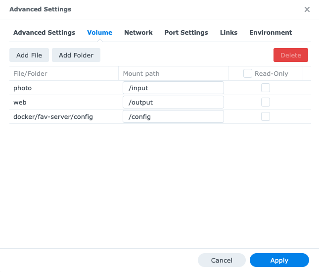

# Fav-server

A docker container containing [thumbsup](https://thumbsup.github.io/), but with an Express API 
to allow you to record (and change) your favourite images through the ThumbsUp website that is generated.

## Requirements

- A machine capable of running Docker (e.g. your computer, a Synology NAS, etc)
- This docker image: `ghcr.io/uglow/thumbsup-fav-server:latest` (which is build using this repo).

## How it works

Fav-server is a simple NodeJS Express application that does one-thing: it creates/updates `picasa.ini` files
with the favourite-state of images that you toggle the favourite-state for (via `theme-cards-fav`).

When the `picasa.ini` files change, the server initiates a rebuild of your site to persist the favourite-state, after a short delay.

[nodemon](https://github.com/remy/nodemon#nodemon) is used to keep the server alive forever, even when there are crashes (which shouldn't happen). 
Note that "alive forever" means "as long as the Docker container is running" when run inside of a Docker container.

## Docker Command Line Parameters

The following additional arguments can be passed on the command line:

- `rebuildDelay` (optional, default = 3sec): Number of seconds to wait before rebuilding the site. Balance between usability (seeing the site update) and performance.

These parameters are passed to the NodeJS server for processing.

## Installation - Local Machine

1. Edit `./run-remote.sh` and change the `input` and `output` source-volumes. By default, these volumes point to `<repo>/example/...`.
2. Run `./run-remote.sh` to start the server in Docker.
3. Create a web-server to server the `output` directory. E.g. `cd <outputDir> && python -m SimpleHTTPServer 8000`
4. Open a browser to `http://localhost:8000/` (or whatever port you have setup in the above step).

## Installation - Synology

The main steps are:
1. Install image onto Synology.
2. Setup config
3. Setup Synology Web Station
4. Configure & Run

### 1. Install image onto Synology

Synology's Docker support for non-DockerHub registries and images is not great. Normally you would
use the Synology > Docker app to add a new Docker image. However, at the time of writing, Synology
cannot read this image: `ghcr.io/uglow/thumbsup-fav-server:latest`.

So here's how to get `ghcr.io/uglow/thumbsup-fav-server:latest` onto the Synology box.

1. Synology: Control Panel -> Terminal & SNMP -> Enable SSH
2. From your computer, in a new terminal window: `ssh <user>@<ip.address.for.synology-device>`
3. Once logged in, `sudo -i` (To be able to use docker on cli. Note: use the same password as your user.)
4. `docker pull ghcr.io/uglow/thumbsup-fav-server:latest`
1. Synology: Control Panel -> Terminal & SNMP -> Disable SSH

After download completes, the image appears in the Synology Docker.

### 2. Setup config

In this step we will provide the Thumbsup theme and config required by the Docker image.

When Docker is installed on Synology, a `/docker` share folder is created. We need to create a sub-folder for the
thumbsup-fav-server config.

1. Open a new terminal window.
2. `git clone https://github.com/uglow/thumbsup-fav-server.git` to copy the source code, **which includes example config**.
3. Copy the files from `<gitRepo>/example/config` to Synology `/docker/fav-server/config`.
4. Edit `config.json` to supply the [Thumbsup config](https://thumbsup.github.io/docs/3-configuration/misc-settings/).
   1. **Do not change the following properties**: `theme-path`, `theme-style`, `albums-from`

### 3. Setup Synology Web Station

There are lots of ways to run a website (including using a Docker image).
But on a Synology NAS, the easiest way is to use Synology Web Station.

1. Synology > Package Center > Search "Web Station"
2. Install the "Web Station" package. Once this is installed you will see a new share-folder
   called `/web`. This will be where the Thumbsup-generated website will be published to.

### 4. Configure & Run

1. Synology: Docker > Image > Select `uglow/thumbsup-fav-server` > Launch:
   

2. Enter the container name, then press "Advanced Settings"
   

3. Advanced Settings > Enable auto-restart. Optionally create a shortcut on the desktop.
   

4. Volume Tab, press Add Folder for each folder below:
   1. Folder: `/photo` (in this example), Mount: `/input`
   2. Folder: `/web` (defined in step 3), Mount: `/output`
   3. Folder: `/docker/fav-server/config` (defined in step 2), Mount: `/config`
   

5. (optional) Environment Tab, set the Command to `rebuild\=5` to rebuild the website after waiting for 5 seconds.
   **Note**: As per [this article](https://stackoverflow.com/questions/56833111/how-to-pass-command-parameters-with-arguments-for-e-g-param1-arg1-to-docker), the `=` characters have to be escaped with `\`. E.g. `inputDir\=...`
   
6. Press Apply.
7. Review the changes, then press Done.

## Running

Open the website. Click the ⭐️ icon for images/photos that you like these selections will
be persisted once the site rebuilds.

## Development

To build and test the docker image locally:

1. Git clone this repo.
2. `cd <repo>`
3. `docker build -t fav-server .` to build the docker image locally (TODO: this is temporary until we host this image somewhere)
4. `./run-local.sh` to start the server in Docker.

## Patch folder

There is often a delay between raising an issue and receiving the feature/fix. To avoid having to wait too long,
the files in the `/patch` folder provide a simple way to add missing features until such time as upstream packages are updated (and there is a chance they may never be updated).

Current patches:
- `patch/thumbsup/node_modules/thumbsup/src/components/index/glob.js`, a fix for [adding mpg support](https://github.com/thumbsup/thumbsup/issues/280). 

## Upgrading

When installing a new Docker image, repeat steps 1,2 and 4 in "Installation - Synology".

## Troubleshooting

### Website not building

The first time you run this container, **it will take a long time before the website is generated**.
You may even find that the container hangs. **Don't worry!** Just restart the Docker container, and Thumbsup
will resume where it left off.

In terms of time, it took over 8 hours to finish building the website for 182 GB of images and videos, including hang-time.
The build is finished once the `/web` folder on Synology contains a bunch of `*.html` files, representing
the different albums. Increasing available RAM improves performance.

### Device is slow while building

Thumbsup has a `--concurrency` option. In order to keep your device responsive, it is best
not to use all the CPU cores on your device for rebuilding the site.
