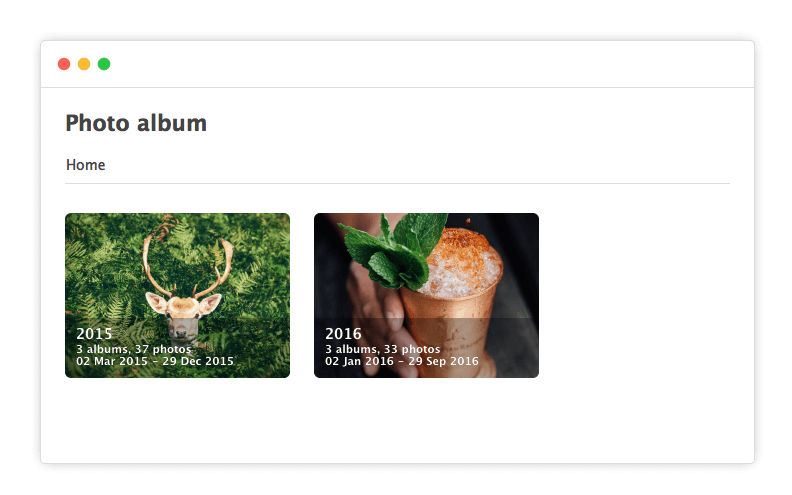
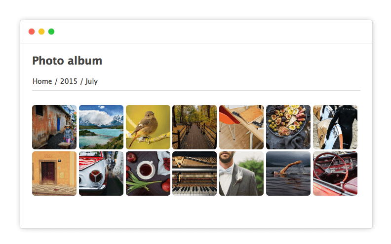

# @thumbsup/theme-cards-fav

[](https://www.npmjs.com/package/@thumbsup/theme-cards)
[](https://travis-ci.org/thumbsup/theme-cards)

A theme for https://github.com/thumbsup/thumbsup which supports favourites

---

## Usage

```bash
thumbsup --theme cards
```

## Screenshots




## Options

You can use override the following variables to customise this theme:

```less
@body-background: #fff;
@body-color: #444;
@header-color: #444;
@nav-border: #ddd;
```

You can add them to your own LESS file, and run thumbsup with `--theme-style custom.less`.

## Developing

Testing the theme

```bash
thumbsup --input /photos --output ./tmp --theme-path ./theme
```

Publishing the theme:

```bash
npm publish --access=public
```
